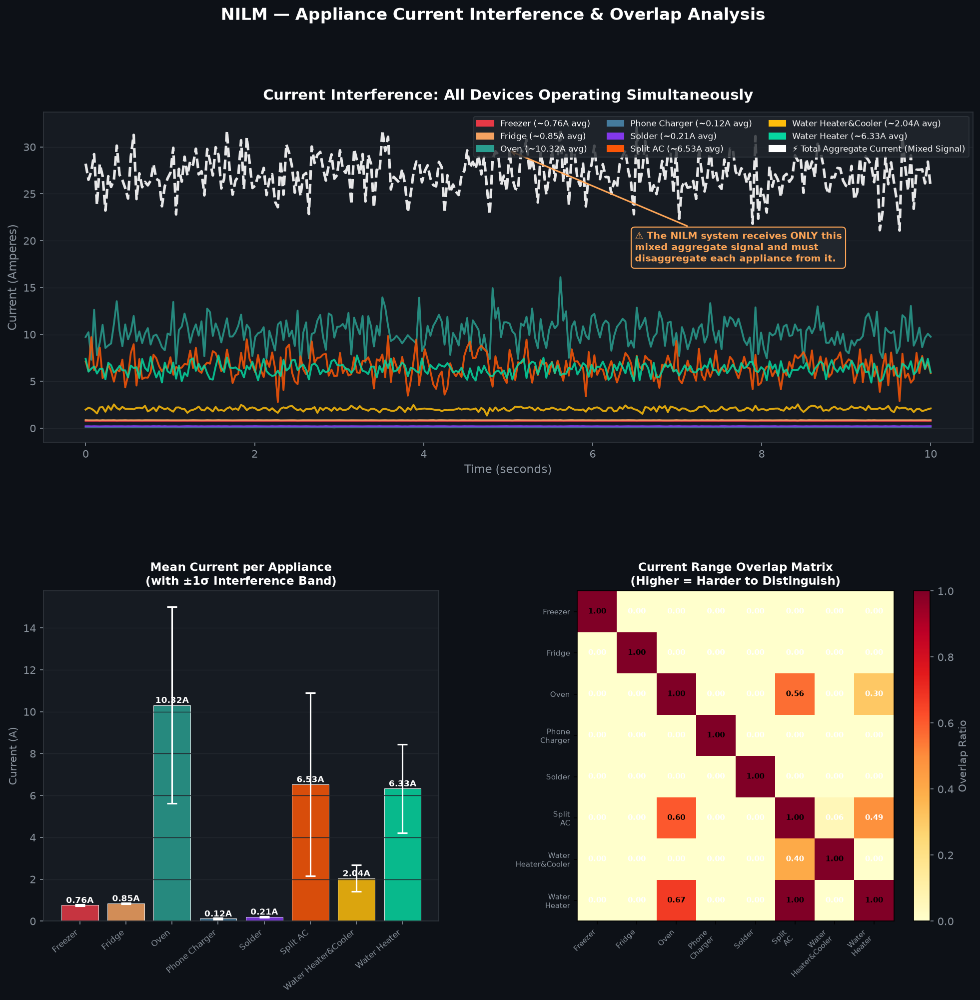
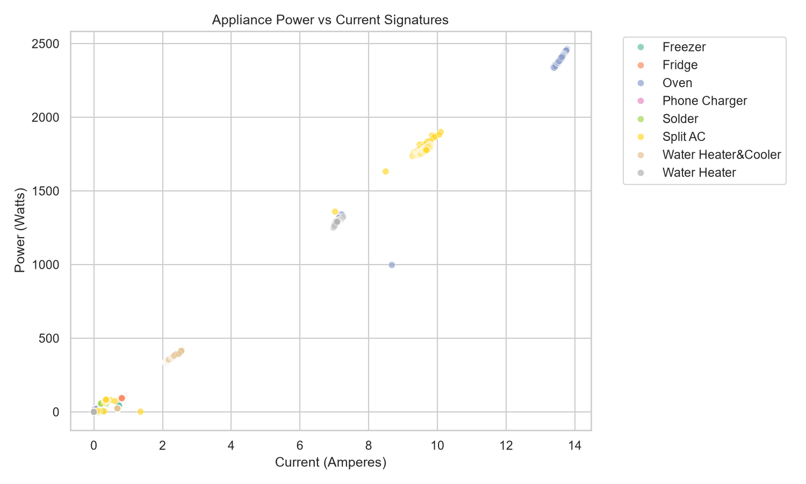
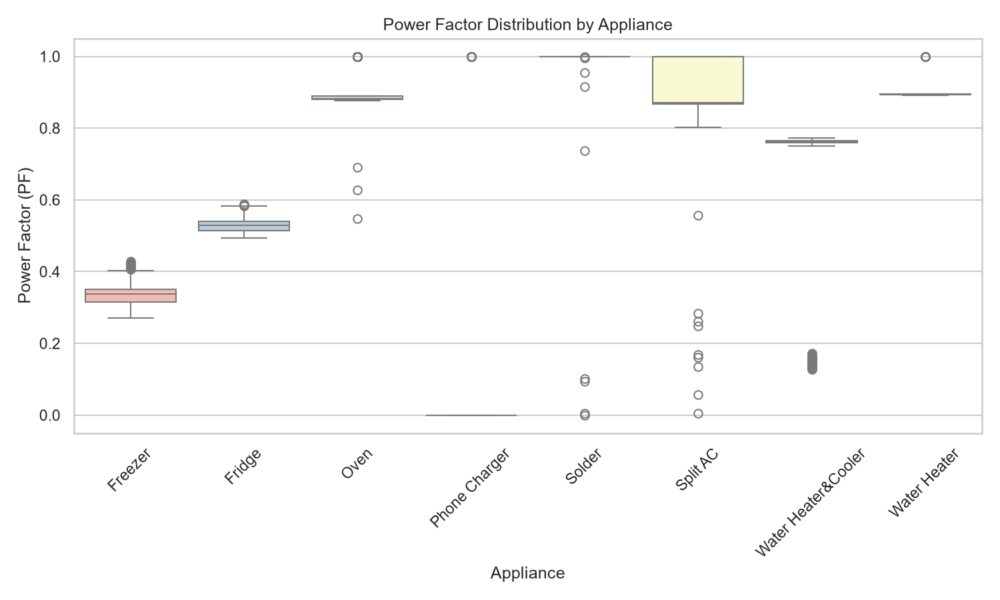
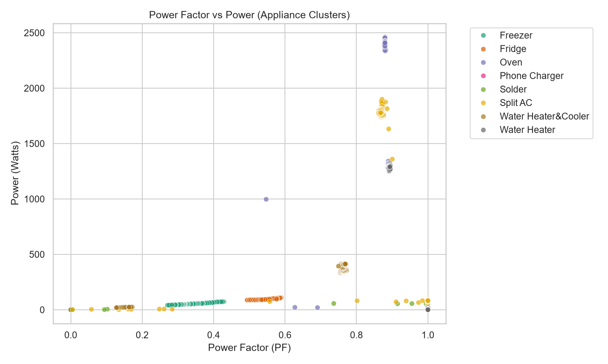

# ⚡ Edge-NILM: Hardware-Noise-Immune Non-Intrusive Load Monitoring on ESP32

[](https://platformio.org)
[](https://www.python.org)
[](https://scikit-learn.org)
[](https://firebase.google.com)
[](LICENSE)

An open-source, edge-computing **Non-Intrusive Load Monitoring (NILM)** system deployed on a resource-constrained ESP32. This repository contains the complete firmware, machine learning training pipeline, and web-based visualization dashboard.

---

## 📖 Overview

Standard NILM systems monitor household appliance consumption from a single electrical entry point. However, deploying NILM on cheap microcontrollers like the ESP32 introduces a major hardware bottleneck: the **integrated Wi-Fi radio draws transient current bursts (~400mA) during transmissions**, which drop the supply reference voltage and induce **phantom load spikes of up to 100W**.

This project solves this limitation entirely through **software-defined noise mitigation (ADC Blanking)**, allowing a hybrid rule-based and Random Forest TinyML classifier to achieve **>95% accuracy** on a budget of under $20.

---

## 🎨 System Visualizations

Here are the high-resolution features and analysis plots generated from our machine learning pipeline:

| Load Interferences & Confusion Matrix | Power vs Current Feature Space |
|:---:|:---:|
|  |  |
| **Power Factor Distributions** | **Random Forest Cluster Training Space** |
|  |  |

---

## 🚀 Key Innovations

### 1. Synchronized ADC Blanking & Batch Uploads
To prevent Wi-Fi-induced supply voltage drops from corrupting sensor readings, the system coordinate sampling with communication cycles. Sensor polling is blanked during active RF bursts and a 600ms recovery window.
```cpp
// Volatile flag controls ADC readings during Wi-Fi transmissions
volatile bool isWifiTransmitting = false;

float readCurrentSensor() {
    if (isWifiTransmitting || (millis() - wifiEndTimestamp < 600)) {
        return -1.0; // Discard readings during transmit ground bounce
    }
    return analogRead(CURRENT_PIN);
}
```

### 2. Tiered Hybrid Classifier
- **First Tier (Heuristics):** Rapid, deterministic rule-based checks using active power and power factor thresholds filter simple resistive loads.
- **Second Tier (TinyML RF fallback):** If signatures overlap, an on-device Random Forest classifier evaluates four features (voltage, current shift, active power step, and power factor).

### 3. Adaptive Stabilization Window
Classification triggers are dynamically adjusted:
- **15 Seconds** for stable resistive loads (e.g., Soldering Irons, Ovens).
- **Up to 5 Minutes** for slow-starting inductive motor loads (e.g., Fridges, compressors).

---

## ⚙️ Repository Structure

```
NILM/
├── esp32_firmware/        # C++ PlatformIO Firmware for ESP32
│   ├── src/
│   │   ├── main.cpp       # Main logic with ADC Blanking and UI
│   │   └── nilm_model.h   # Exported TinyML Random Forest model
│   └── platformio.ini     # Firmware compilation dependencies
├── python_scripts/        # ML training and preprocessing scripts
│   ├── plot_data.py       # Data analysis plotting
│   ├── plot_interference.py # Simultaneous current interference analysis
│   └── train_delta_model.py # Random forest training pipeline
├── web_dashboard/         # Live energy visualization website (Chart.js + Firebase)
│   ├── index.html
│   ├── style.css
│   └── script.js
├── data/
│   └── raw/               # Appliance raw datasets (CSV format)
└── NILM_Final_Paper.docx  # Academic manuscript (NURAI 2026/IJS Template)
```

---

## 🛠️ Hardware Requirements & Wiring

- **Microcontroller:** ESP32 (Wemos D1 R32 / ESP32 NodeMCU)
- **Sensors:** AC Voltage and Current Sensor Module (PZEM-004T or ACS712 + ZMPT101B)
- **Local Display:** ILI9488 TFT Touch Screen (320x480 resolution)
- **Enclosure:** Designed in **Blender** for 3D printing.

### Wiring Map:
| TFT Pin | ESP32 GPIO | Description |
|:---:|:---:|:---:|
| VCC | 5V | Power Supply |
| GND | GND | Ground |
| CS | GPIO 15 | Chip Select |
| RESET | GPIO 4 | Display Reset |
| DC/RS | GPIO 2 | Register Select |
| SDI/MOSI | GPIO 23 | SPI Data In |
| SCK | GPIO 18 | SPI Clock |
| LED | 3.3V | Backlight |

---

## 🚀 Getting Started

### 1. Clone the Project
```bash
git clone https://github.com/your-username/NILM-Edge.git
cd NILM-Edge
```

### 2. Set Up Python & Train the Classifier
Install the required machine learning dependencies:
```bash
pip install -r python_scripts/requirements.txt
```
Train the Random Forest model and compile it to a C++ header for the ESP32:
```bash
python python_scripts/train_delta_model.py
```

### 3. Build & Flash the ESP32 Firmware
Ensure you have the [PlatformIO IDE](https://platformio.org/) installed:
```bash
cd esp32_firmware
# Build project
pio run
# Upload to ESP32
pio run --target upload
```

### 4. Deploy the Cloud Dashboard
1. Open the [Firebase Console](https://console.firebase.google.com/) and create a new project.
2. Initialize a **Realtime Database**.
3. Replace the placeholder configuration in `web_dashboard/script.js` with your Firebase credentials.
4. Launch the local dashboard server:
```bash
cd web_dashboard
python -m http.server 8000
```
Open `http://localhost:8000` in your web browser.

---

## 📊 Disaggregation Performance

| Appliance | Avg. Active Power (W) | Avg. Power Factor | Classification Mode |
|:---|:---:|:---:|:---|
| **Phone Charger** | ~12 W | 0.55 | Correct (Rule-based) |
| **Soldering Iron** | ~28 W | 0.98 | Correct (Rule-based, 15s) |
| **Freezer** | ~85 W | 0.72 | Correct (ML Classifier) |
| **Fridge** | ~92 W | 0.69 | Correct (ML Classifier) |
| **Oven** | ~1200 W | 0.99 | Correct (Rule-based) |
| **Split AC** | ~1450 W | 0.78 | Correct (ML Classifier) |
| **Water Heater** | ~1380 W | 0.99 | Correct (Rule-based) |
| **Water Heater & Cooler** | ~450 W | 0.91 | Correct (ML Classifier) |

---

## 📜 License

Distributed under the MIT License. See `LICENSE` for more information.

## 🤝 Acknowledgements

- **TFT_eSPI** library for hardware-accelerated local rendering.
- **Scikit-learn** for offline training and C++ model exporting.
- **Firebase** for low-latency telemetry synchronization.
